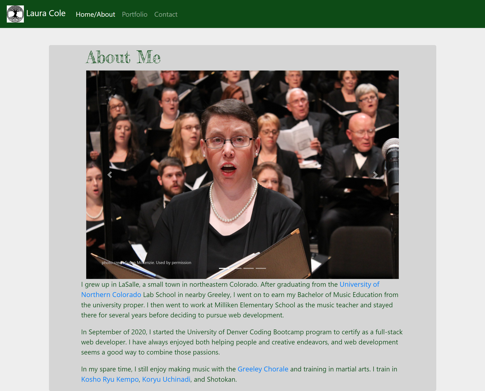
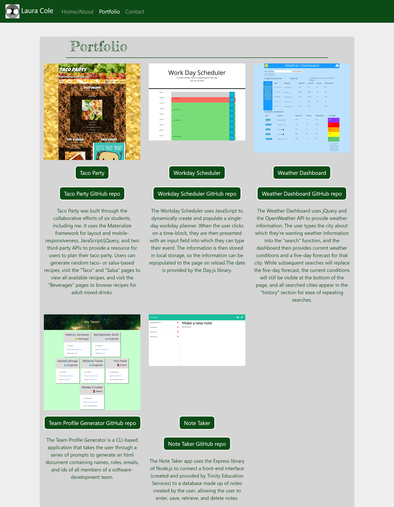
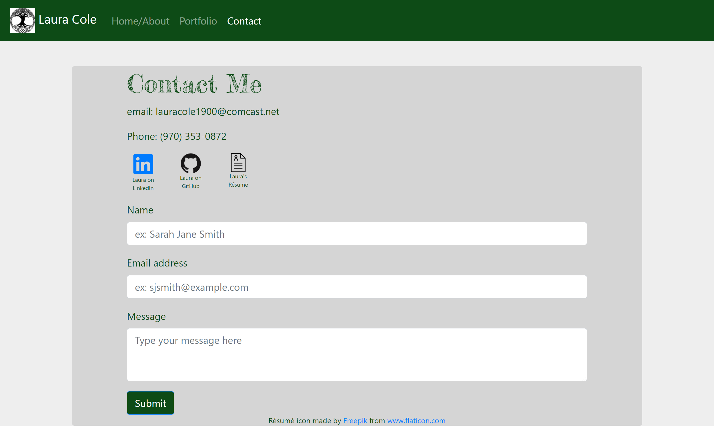

# Bootstrap Portfolio

## Table of Contents

* [Description](#description)
* [Links](#links)
* [Screenshots](#screenshots)
* [Installation Instructions](#installation-instructions)
* [Usage](#usage)
* [Technologies Used](#technologies-used)
* [Tests](#tests)
* [Credits](#credits)
* [Contributing](#contributing)
* [Questions](#questions)
* [License](#license)

## Description

This is a website about me, including biographical information, a portfolio page, and a contact form. This project includes the use of Bootstrap.

## Links

[Laura Cole site](https://lauracole1900.github.io/ResponsivePortfolioAboutMe/)

## Screenshots

About Me page:


Portfolio page:


Contact Me page:


## Installation Instructions

If you want to run a copy of this app on your local machine, first clone the repository:

HTTPS:
```
$ git clone https://github.com/LauraCole1900/ResponsivePortfolioAboutMe.git
```

SSH:
```
$ git clone git@github.com:LauraCole1900/ResponsivePortfolioAboutMe.git
```

Then cd into the directory into which you cloned, right-click on any of the HTML files, and choose "Open in default browser."

## Usage

This project is intended to be used as a my first, basic portfolio site.

## Technologies Used

HTML, CSS, Bootstrap

## Tests

npm run test

## Credits

N/A

## Contributing

N/A

## Questions

If you have further questions, you can reach me at lauracole1900@comcast.net. For more of my work, see [my GitHub](https://github.com/LauraCole1900).

## License

.